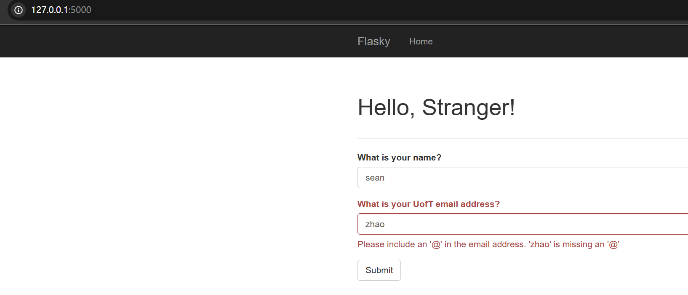

# Flask and Docker
> Hi, my name is Xiaoxiao (Sean) Zhao!

> This repo is a clone of https://github.com/miguelgrinberg/flasky

### Activity 1.2
Reproduction of example 2-1:

Reproduction of example 2-2:

### Activity 1.3
Reproduction of Chapter 3 examples:

### Activity 1.4
Modification of Chapter 4 example:

### Activity 2.3

